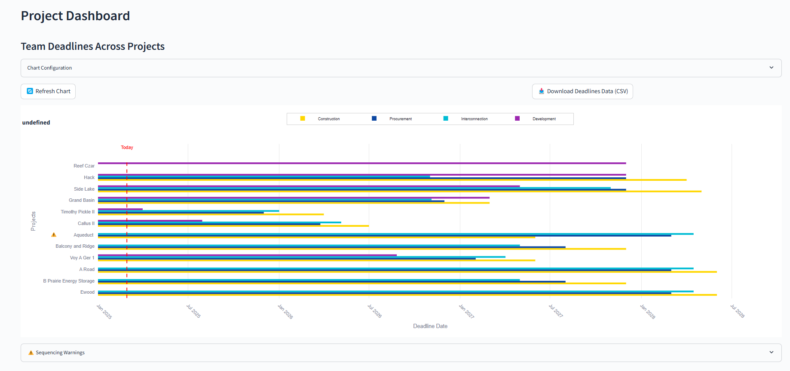
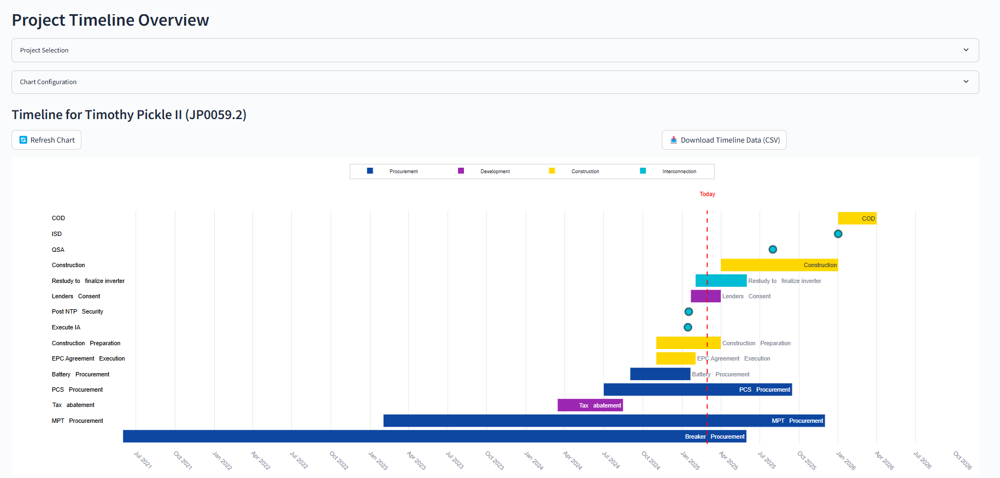
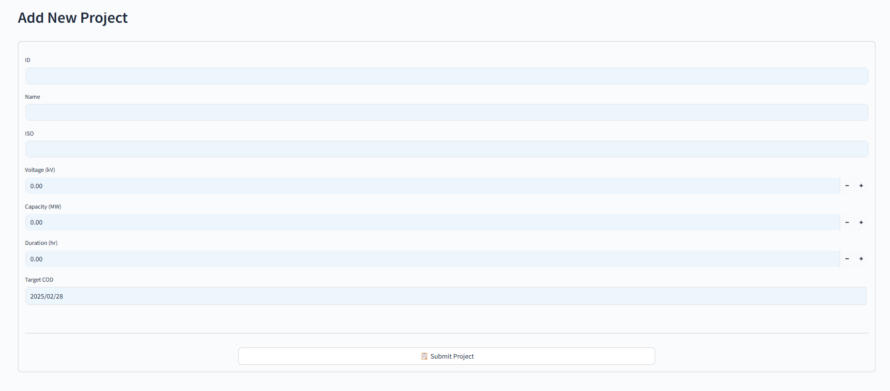
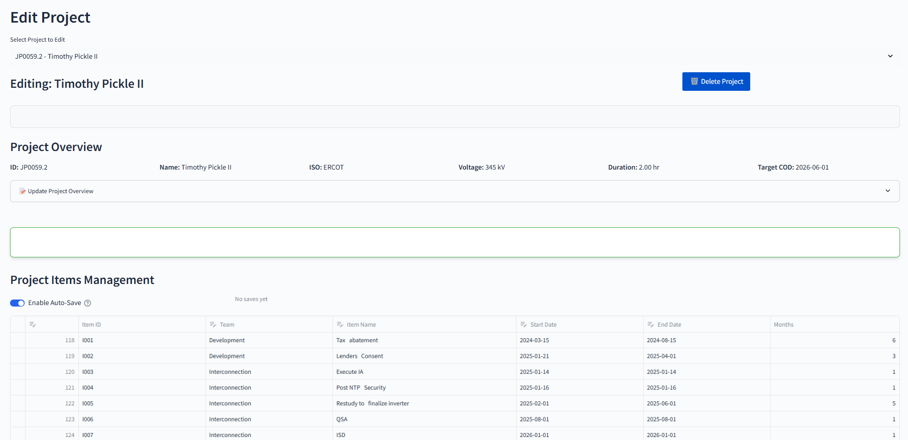

# Company XYZ Project Management


## Overview

Company XYZ Project Management is a comprehensive Streamlit web application designed to streamline the management of energy infrastructure projects. The application provides robust functionality for tracking project timelines, managing critical paths, and visualizing team deadlines across various projects.

## Features

- **Project Dashboard:** Overview of all projects with key metrics and deadlines
- **Critical Path Visualization:** Interactive Gantt charts for project timeline visualization
- **Team Deadline Tracking:** Track deadlines across different teams and projects
- **Project Management:** Add, edit, and delete projects with a user-friendly interface
- **Timeline Management:** Manage project items with start/end dates and team assignments
- **Data Export:** Export project data in CSV format for further analysis

## Screenshots


The Dashboard tab provides a comprehensive overview of all projects and their timelines. It features a Team Deadlines Chart that visualizes when each team's work concludes across all projects. The chart is highly customizable - you can filter by ISO region, adjust date ranges, and modify the time interval for better visualization. This tab helps identify potential scheduling conflicts and gives a bird's-eye view of our entire project portfolio.


The Critical Path tab displays detailed timeline visualizations for individual projects. After selecting a project from the dropdown menu, you'll see a Gantt chart showing all project items arranged chronologically with color-coding by team. The timeline clearly marks today's date and allows for customization of the chart display, including date ranges and chart height. This view is essential for tracking individual project progress and identifying potential bottlenecks in the schedule


The Add Project tab provides a streamlined form for creating new projects in the system. Users can enter basic project information including ID, name, ISO region, voltage, capacity, duration, and target COD (Commercial Operation Date). The form includes validation to ensure all required fields are completed before submission. This tab allows for quick addition of new projects that will then appear in the dashboard and critical path views.


The Edit Project tab enables comprehensive management of existing projects. After selecting a project from the dropdown, users can modify project details, add new timeline items, and edit existing ones. The interface includes an overview section showing project details, an items management section with auto-save capability, and the ability to delete projects when needed. This tab serves as the main workflow for maintaining and updating project data as timelines evolve

## Technology Stack

- **Frontend:** Streamlit
- **Data Management:** Pandas, CSV file storage
- **Visualization:** Plotly
- **Deployment:** Replit

## Installation and Setup

### Prerequisites

- Python 3.11+
- Pandas, Streamlit, Plotly, and other dependencies

### Installation

1. Clone the repository:
   ```
   git clone https://github.com/yourusername/company-xyz-project-management.git
   cd company-xyz-project-management
   ```

2. Install dependencies:
   ```
   pip install -r requirements.txt
   ```

3. Run the application:
   ```
   streamlit run app.py
   ```

## Project Structure

```
├── app.py                   # Main application entry point
├── run.sh                   # Shell script for running the application
├── health_check.py          # Health check server for deployment
├── components/              # Application components
│   ├── data_storage.py      # Data storage utilities
│   ├── data_manager.py      # Data management logic
│   ├── forms.py             # Form components
│   └── timeline_viz.py      # Timeline visualization components
├── utils/                   # Utility functions
│   └── helpers.py           # Helper functions
├── data/                    # Data storage directory
│   ├── projects.csv         # Project data
│   └── items.csv            # Project items data
└── assets/                  # Static assets
```

## Usage Guide

### Adding a New Project

1. Navigate to the "Add Project" tab
2. Fill in the project details including name, ISO, voltage, capacity, etc.
3. Submit the form to create a new project

### Editing Project Timeline

1. Go to the "Edit Project" tab
2. Select a project from the dropdown
3. Add or edit timeline items with team assignments and dates
4. Save your changes

### Viewing Timeline

1. Navigate to the "Critical Path" tab
2. Select a project to view its Gantt chart
3. Use the configuration options to customize the view

## Deployment

This application is deployed on Replit and uses a custom health check server to ensure availability.

## Development

### Adding New Features

1. Fork the repository
2. Create a feature branch
3. Implement your changes
4. Submit a pull request

### Code Style

This project follows PEP 8 style guidelines for Python code.

## Future Enhancements

- Database integration for improved data persistence
- User authentication and role-based access control
- Advanced filtering and search capabilities
- Email notifications for approaching deadlines


